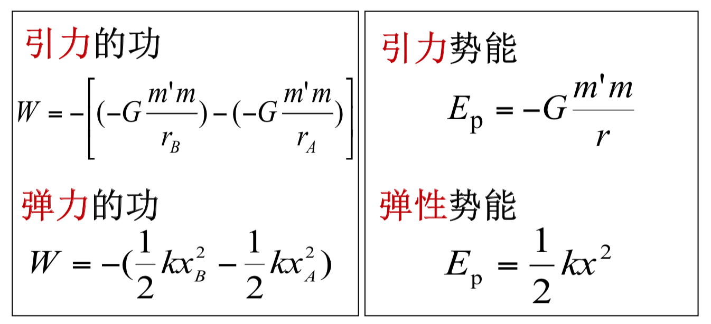
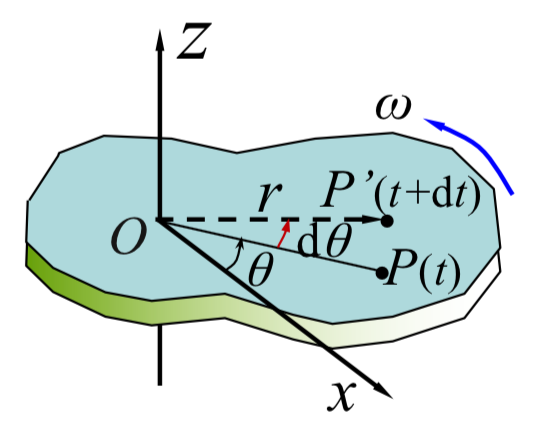
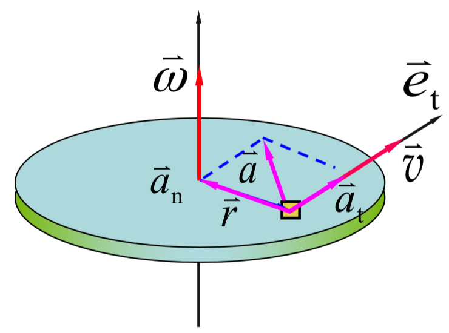
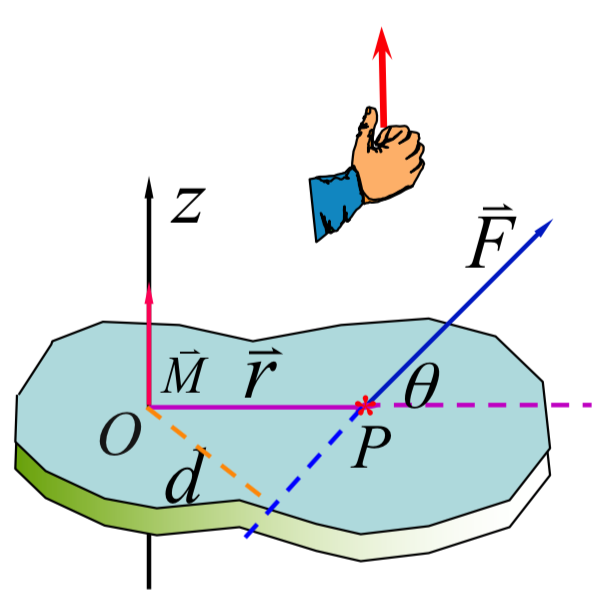

# 从零开始~~放弃~~的大学物理学习指南

大物太久没看，很多知识点已经遗忘，只能尽量回忆起当时的总结，按照我使用的课本的章节顺序写的，部分内容顺序可能会有所出入，但是知识点基本都重合。以我的能力可能只能做到解释一下一些公式的作用，并不能有什么万能的学习解题法宝。很抱歉，小粉丝只能做这一点微小的贡献了，望能对心瑶大物解题有帮助

## 写在最前

> 熊心瑶世界第一 ____（真的
——大家都这么说

向量点积(内积)公式:$\vec{a}\cdot\vec{b}=|\vec{a}||\vec{b}|\cos\theta$

向量叉积(外积)公式:$\vec{a}\times\vec{b}=\vec{e}|\vec{a}||\vec{b}|\sin\theta$, $\vec{e}$ 方向满足右手定则.

## 质点运动

### 直线运动

直角坐标系中一点P，原点到P的可用位矢$\vec{r}$表示, $\vec{r}=\rm {x} \vec{i} +\rm {y} \vec{j} + \rm {z} \vec{k}$, 位矢大小$|\vec{r}|=\sqrt{x^2+y^2+z^2}$ (向量运算,求模不是绝对值).

两点间位移可表示为$\Delta\vec{r}=\vec{r_A}-\vec{r_B}=(\rm {x_A-x_B}) \vec{i} +(\rm {y_A-y_B}) \vec{j} + (\rm {z_A-z_B}) \vec{k}$, 位移只表示两点变化的结果,不表示实际运动的路径过程.

平均速度: $\overline{\vec{v}}=\frac{\vec{r_2}-\vec{r_1}}{\Delta t}=\frac{\Delta \vec{r}}{\Delta t}$, 也可以分解成$\overline{\vec{v}}=\overline {v_x} \vec{i} +\overline{v_y} \vec{j} + \overline{v_z} \vec{k}$

速度: $\lim_{\Delta t \rightarrow 0} \frac{\Delta\vec{r}}{\Delta t}=\frac{\rm d \vec{r}}{\rm{d} t}$, 或者 ${\vec{v}}= {v_x} \vec{i} +{v_y} \vec{j} + {v_z} \vec{k}$

其中 $v_x=\frac{\rm d x}{\rm d t}$, $v_y, v_z$以此类推.

公式可根据坐标轴维度自行增删

加速度:  $\lim_{\Delta t \rightarrow 0} \frac{\Delta\vec{v}}{\Delta t}=\frac{\rm d \vec{v}}{\rm{d} t}$

#### 一些小结

位移: $\vec s(t)$
速度: $\vec v(t) = \frac{\rm d \vec s(t)}{\rm d t}$
加速度: $\vec a(t) =\frac{\rm d \vec v(t)}{\rm d t}$
注意矢量方向
反过去就是积分关系

一般有两种问题:

1. 已知运动方程求运动状态

2. 已知运动状态求运动方程

速度可以分解, 合成, 可以先分开求解后再合成得出答案
求轨迹图可根据运动方程$x(t),y(t)$, 消去t参数,就可以得到$y(x)$轨迹

### 圆周运动

法向加速度$\vec{a_n}$(指向圆心), 切向加速度$\vec{a_t}$(运动切线方向)

#### 线量与角量关系

角坐标为时间函数: $\theta(t)$
角速度: $\omega = \frac{\rm d \theta}{\rm d t}$(弧度制)
$\rm d s = R \rm d \theta$ (d意为取一微元量,下同)
$v=\frac{\rm d s}{\rm d t}=R\frac{\rm d \theta}{\rm d t}=R\omega$
$\begin{cases} a_n=\frac{v^2}{R}=R\omega^2 \\ a_t=\frac{\rm d v}{\rm d t}=R\frac{\rm d \omega}{\rm d t}=R\alpha \end{cases}$

$\vec{a}=\vec{a_n}+\vec{a_t}$
$|a|=\sqrt{a_n^2+a_t^2}$ (大小)
$\vec{a}=r\alpha \vec{e_t}+r\omega^2 \vec{e_n}$ (方向)
$\theta=\tan^{-1}{\frac{a_n}{a_t}}$

### 相对运动(伽利略速度变换)

$\vec{v}=\vec{v'}+\vec{u}$
(接近光速请使用洛伦兹变换)

## 牛顿定理

1. $\vec{v}=恒矢量,当\vec{F}=0$

2. $\vec{p}=m\vec{v}$, $\vec{F}=\frac{\rm d \vec{p}}{\rm d t}=\frac{\rm d (m\vec{v})}{\rm d t}$, 远小于光速时:$\vec{F}=m\frac{\rm d \vec{v}}{\rm d t}=m\vec{a}$

3. $\vec{F}=-\vec{F'}$

### 常见的力

#### 万有引力

$F=G\frac{m_1m_2}{r^2}$, $\vec{F}=-G\frac{m_1m_2}{r^2}\vec{e_r}$(向量形式)

#### 弹性力

常见弹性力有:正压力、张力、弹簧弹性力等
弹簧弹性力:
> $F = −kx$
胡克定律

#### 摩擦力

滑动摩擦力 最大静摩擦力: $F =\mu F_N$
静摩擦力 一般情况: $F_{f_0 m} = \mu_0 F_N$
$F_{f_0}\leq F_{f_0 m}$
$\mu \approx \mu_0$

遗忘得太严重,只能这样了

## 动量守恒与能量守恒

### 动量定理

微分形式:
$\vec{F}=\frac{\rm d \vec{p}}{\rm d t}=\frac{\rm d (m\vec{v})}{\rm d t}$, $\vec{F}\rm d t=\rm d \vec{p}=\rm d (m\vec{v})$
积分形式:
$\vec{I}=\int_{t_1}^{t_2}\vec{F}(t)\rm d t=\vec{p_2}-\vec{p_1}=m\vec{v_2}-m\vec{v_1}$
作用于系统的合外力的冲量等于系统动量的增量(质点的动量定理) ~~我不知道这说的是啥~~

$\vec{F^{ex}}=\frac{\rm d \vec{p}}{\rm d t}$

### 动量守恒定理

$\vec{p}=\sum_{i=1}^n m_i\vec{v_i}=恒矢量$ (系统合外力为零)

### 变力做功

$\rm dW = \vec{F}\cdot \rm d \vec{r}$
$\therefore \rm dW=F\cos{\theta}|\rm d \vec{r}|$

将微元量积分,可得
$W=\int_A^B{\vec{F} \cdot\rm d \vec{r}}=\int_A^B{F \cos \theta \rm d s}(\rm d s = |\rm d \vec{r}|)$(向量点积公式)

### 质点的动能定理

$W=\frac{1}{2}mv_2^2-\frac{1}{2}mv_1^2=E_{k2}-E_{k1}$

* 功是过程量，动能是状态量

* 功和动能依赖于惯性系的选取，但对不同惯性系动能定理形式相同.

### 保守力与非保守力

#### 保守力作功的数学表达式

保守力所作的功与路径无关，仅决定于始、末位置.

引力做功:$W=-[(-G\frac{m'm}{r_B})-(-G\frac{m'm}{r_A})]$

弹力做功:$W=-(\frac{1}{2}kx_B^2-\frac{1}{2}kx_A^2)$

### 势能

与质点位置有关的能量.

### 功能关系

$W^{ex}+W_{nc}^{in}=(E_k+E_p)-(E_{k0}+E_{p0})$

#### 机械能

$E=E_k+E_p$

$W^{ex}+W_{nc}^{in}=E-E_0$

一般情况碰撞$\vec{F^{ex}} << \vec{F^{in}} \sum_i p_i =\vec{C}$

1. 完全弹性碰撞: 动量和机械能均守恒

2. 非弹性碰撞: 动量守恒，机械能不守恒

3. 完全非弹性碰撞: 动量守恒，机械能不守恒

## 刚体转动

### 角速度与角加速度

角坐标: $\theta=\theta(t)$ (角度是关于时间的函数)

* 沿逆时针方向转动$\theta>0$

* 沿顺时针方向转动$\theta<0$

角位移: $\Delta\theta=\theta(t+\Delta t)-\theta(t)$

角速度: $\omega=\lim_{\Delta t \rightarrow 0}\frac{\Delta \theta}{\Delta t}=\frac{\rm d \theta}{\rm d t}$

$\vec{\omega}$正方向,右手螺旋,拇指所指的方向

### 匀变速转动

角加速度: $\alpha=\lim_{\Delta t \rightarrow 0}\frac{\Delta \omega}{\Delta t}=\frac{\rm d \omega}{\rm d t}$

#### 匀变速直线运动匀变速转动的对比

当加速度/角加速度为常量时

|质点匀变速直线运动|刚体绕定轴作匀变速转动|
|---|---|
|$v=v_0+at$|$\omega=\omega_0+\alpha t$|
|$x = x_0 + v_0 t + \frac{1}{2}at^2$|$\theta = \theta_0 + \omega_0 t + \frac{1}{2}\alpha t^2$|
|$v^2 =v_0^2 +2a(x−x_0)$|$\omega^2 = \omega_0^2 + 2 \alpha ( θ − θ_0 )$|

#### 角量与线量的关系

$\omega=\frac{\rm d \theta}{\rm d t}$
$\alpha=\frac{\rm d \omega}{\rm d t}=\frac{\rm{d^2}\theta}{\rm d t^2}$ (两次求导的意思)

$v=r\omega$
$a_t=r\alpha$ (切向)
$a_n=r\omega^2$ (法向)
$\vec{a}=r\alpha \vec{e_t} +r\omega^2\vec{e_n}$

#### 力矩

用来描述力对刚体的转动作用

$\vec{F}$ 对转轴z的力矩
**$\vec{M}=\vec{r}\times\vec{F}$
$M=Fr\sin\theta=Fd$ (d为力臂)

**所以通过中心轴的力的力矩为0**

#### 转动惯量(重点)

$J=\sum_j \Delta m_j r_j^2(离散情况)=\int r^2\rm d m(连续的情况下)$

* 转动惯量的单位:kg·m2

* J的意义:转动惯性的量度

**刚体的转动惯量与以下三个因素有关**

1. 与刚体的体密度 ρ 有关.

2. 与刚体的几何形状及体密度 ρ 的分 布有关.

3. 与转轴的位置有关.

> 说点人话
把转动惯量理解成与质量, 密度一样是一个刚体本身的一种属性就基本OK了

##### 几种常见刚体的转动惯量

(书上一般有表,在这里写几个常用的)
|物体类型|转动惯量|
|---|---|
细棒(转动轴通过并且垂直于细棒中心)|$J=\frac{ml^2}{12}$
圆柱体(转动轴沿几何轴 //理解为圆心, 常用的一个, 滑轮转动问题经常用)|$J=\frac{mR^2}{2}$(R为圆柱体半径)
球体(转动轴过球径)|$J=\frac{2mR^2}{5}$
细棒(转动轴在细棒的一端且垂直)|$J=\frac{ml^2}{3}

#### 转动定律(结合转动惯量与力矩的知识点)

$M=J\alpha$
> 转动定律是解决刚体定轴转动问题的基本方程

#### 平行轴定理

质量为m的刚体, 如果对其质心轴的转动惯量为$J_C$ ，则对任一与该轴平行，相距为d的转轴的转动惯量: $J_O =J_C +md^2$

#### 关于运用转动惯量的一般解题思路(不同于高中物理的解题方法)

> 如图所示,质量为$m_A$的物体A静止在光滑水平面上,它和一质量不计的纯索相连接,此绳索跨过一半径为R、质量为$m_c$的圆柱形滑轮C,并系在另一质量为$m_B$的物体B上,B竖直悬挂,圆柱形滑轮可绕其几何中心轴转动,当滑轮转动时,它与绳索间没有滑动,且滑轮与轴承间的摩擦力可略去不计,问:
1. 这两物体的线加速度为多少?水平和竖直两段绳索的张力各为多少?
2. 物体从静止落下距离y时,其速率为多少?

解题思路

1. 先分别对各个物体分别进行受力分析 **($F_{T2}=F_{T2}'$, $F_{T1}=F_{T1}'$, 但是$F_{T2}\neq F_{T1}$ )

2. 分别计算A, B 加速度(对于此题:$F_{T1}=m_Aa$ **1, $m_B-F_{T2}=m_Ba$ **2)

3. 对于C,计算力矩 (此题: $M=Fr\sin\theta=Fr=RF_{T2}-RF_{T1}=J\alpha$ **3 (此处结合受力分析以及运用转动定律)

4. 将转动惯量J(查表)代入**3,并且结合转动线角关系 $a_t=R\alpha$ (滑轮边缘切向加速度与绳索和物体的加速度大小相等), 联立三个方程求解即可

### 角动量与角动量守恒

#### 质点的角动量

$\vec{L}=\vec{r}\times\vec{p}=m\vec{r}\times\vec{v}$

可得
$L=rmv\sin\theta$ (标量形式)**重要的公式**

#### 质点的角动量定理

$\vec{r}\times\vec{F}=\vec{M_{合力矩}}=\frac{\rm d\vec{L}}{\rm d t}=\frac{\rm d}{\rm d t}(\vec{r}\times m\vec{v})$

两端积分:
$\int_{t_1}^{t_2}\vec{M}\rm d t=\vec{L_2}-\vec{L_1}$

若$\vec{M}=0$, $\vec{L}=m\vec{r}\times\vec{v}=恒矢量$ (质点的角动量守恒定理)

#### 两道例题

##### 例1

> 一杂技演员M由距水平跷板高为h处自由下落到跷板的一端A,并把板另一端的演员N弹了起来,设板是匀质的,长度为L,质量为m',支撑点在板的中部点C,晓板可绕点C在竖直平面内转动,演员M, N的质量都是m,假定演员M落在板上,与跳板的碰撞是完全非弹性碰撞,问演员N弹起多高

解题思路:
> 为使讨论简化,把演员视为质点,演员M落在板A处的速率为$v_m=\sqrt{2gh}$,这个,速率也就是演员M与板A处刚碰撞时的速率,此时演员N的速率$v_n=0$.**在碰撞后的瞬时,演员M, N具有相同的线速率u,其值为$u=\frac{l}{2}\omega$, $\omega$为演员和板绕点C的角速率**,现把演员M, N和板作为一个系统,并以通过点C垂直纸平面的轴为转轴,由于M, N两演员的**质量相等**,所以当演员M碰撞板A处时,**作用在系统上的合外力矩为零**,故系统的**角动量守恒**

可获得方程:
$$
\begin{cases}
mv_m\frac{l}{2}=\overbrace{J\omega}^{棒的角动量}+\overbrace{2mu\frac{l}{2}}^{两个演员的角动量}=J\omega+\frac{1}{2}ml^2\omega \\ \\
J=\frac{1}{12}m'l^2(查表)\\ \\
u=\frac{l}{2}\omega
\end{cases}
$$

解出$\omega$,再代入$h'=\frac{u^2}{2g}$(反向自由落体)

##### 例2

> 有一根质量很小的长度为l的均匀细杆,可绕通过其中心点O并与纸平面垂直的轴在竖直平面内转动,当细杆静止于水平位置时,有一只小虫以速率$v_0$,垂直落在距点O为l/4处,并背离点O向细杆的端点A爬行.
设小虫的**质量与细杆的质量均为m**, 问:欲使细杆以**恒定的角速度**转动,小虫应以多大速率向斜杆端点爬行。

解题思路:
> 解小虫落在杆上,可视完全非弹性碰撞,且碰撞时间极短,重力的动量矩可略去不计,于是,细杆带着小虫一起以角速度$\omega$转动,在碰撞前后,小虫和细杆系统的角动量守恒

有:
$$\overbrace{mv_0\frac{l}{4}}^{角动量}=\overbrace{[\frac{l}{12}ml^2+m(\frac{l}{4})^2]}^{小虫与细棒整体的转动惯量}\omega$$
得
$\omega=\frac{12}{7}\frac{v_0}{l}$ **1

系统合外力矩仅为小虫重力矩
$M=mgr\cos\theta$ **2

要求角速度恒定
$M=\frac{\rm d L}{\rm d t}=\frac{\rm d}{\rm dt}(J\omega)=\omega\frac{\rm dJ}{\rm dt}$ **3

运用平行轴定理
$J=\frac{1}{12}ml^2+mr^2$

求微分,可得
$\frac{\rm dJ}{\rm dt}=2mr\frac{\rm dr}{\rm dt}$ **4 (r为关于时间的t函数)

**2 **4 代入 **3,得
$mgr\cos\theta=2mr\omega\frac{\rm dr}{\rm dt}$

结合
$\theta=\omega t$

求解出$\frac{\rm dr}{\rm dt}$, 即为答案.

### 刚体绕定轴转动的动能定理

$W=\int_{\theta_1}^{\theta_2} M \rm d\theta = \int_{\theta_1}^{\theta_2} J\frac{\rm d\omega}{\rm dt} d\theta=\int_{\omega_1}^{\omega_2} J\omega\rm d\omega$, 