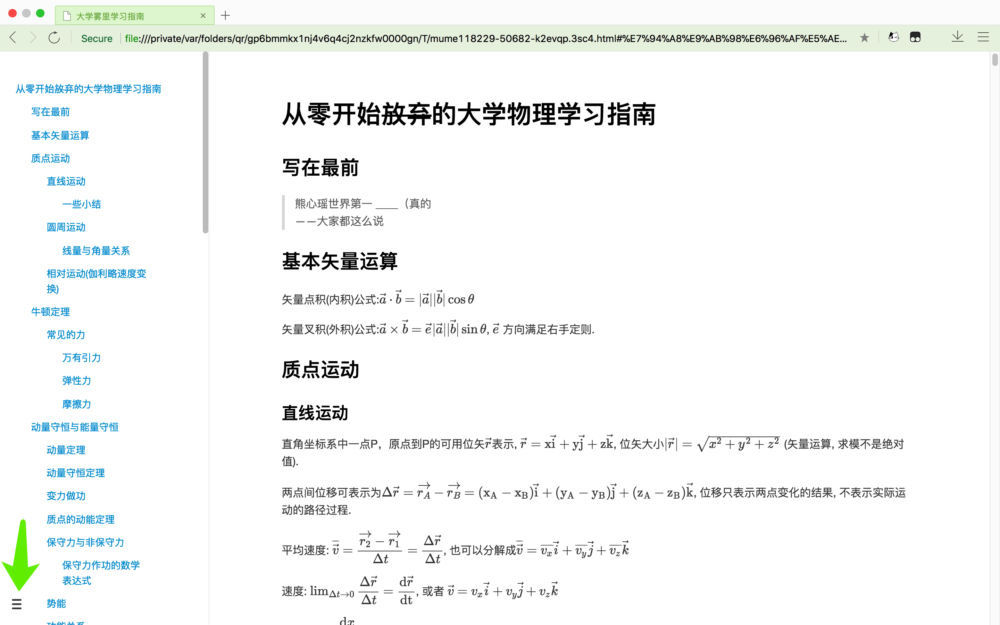

# 从零开始~~放弃~~的大学物理指南的指南

**点击右斜上方绿色按钮打包下载**

本教程使用Markdown+Mathjax进行排版, 已经导出成为html网页文件,直接使用浏览器打开就可以观看. offline版本可以在没有网络的情况下也可以显示公式(ps: 点击指南网页的左下角可以展开目录)

## 如果想使用文档编辑器观看`.md`文档

你可以在点击后面的链接获得[VSCode下载](https://code.visualstudio.com)以及[Markdown插件安装教程](https://shd101wyy.github.io/markdown-preview-enhanced/#/zh-cn/vscode-installation), 还有其他的使用指南

需要进入设置找到`markdown-preview-enhanced.mathRenderingOption`将其改为`MathJax`

## 温馨提示

大物太久没看，很多知识点已经遗忘，只能尽量回忆起当时的总结，按照我使用的课本的章节顺序撰写，部分内容顺序可能会有所出入，但是知识点基本都重合。
以我的能力可能只能做到解释一下一些公式的作用，再加上一些数量不多的题目的解析~~并不能有什么万能的学习解题法宝~~。

指南所有的图片均已命名好放在pics文件夹下面

很抱歉，小粉丝只能做这一点微小的贡献了，望能对心瑶大物解题有帮助

## 最后

祝学习愉快, 偶像事业顺利 ✧(≖ ◡ ≖✿)
