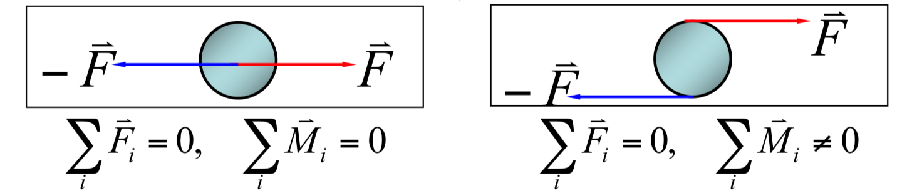
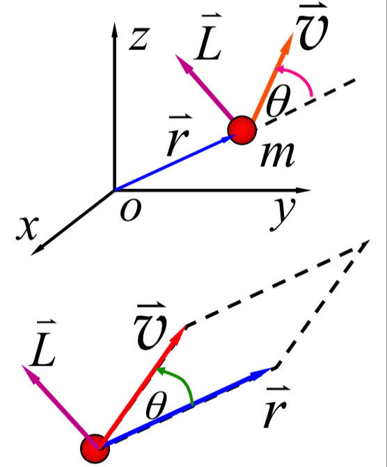
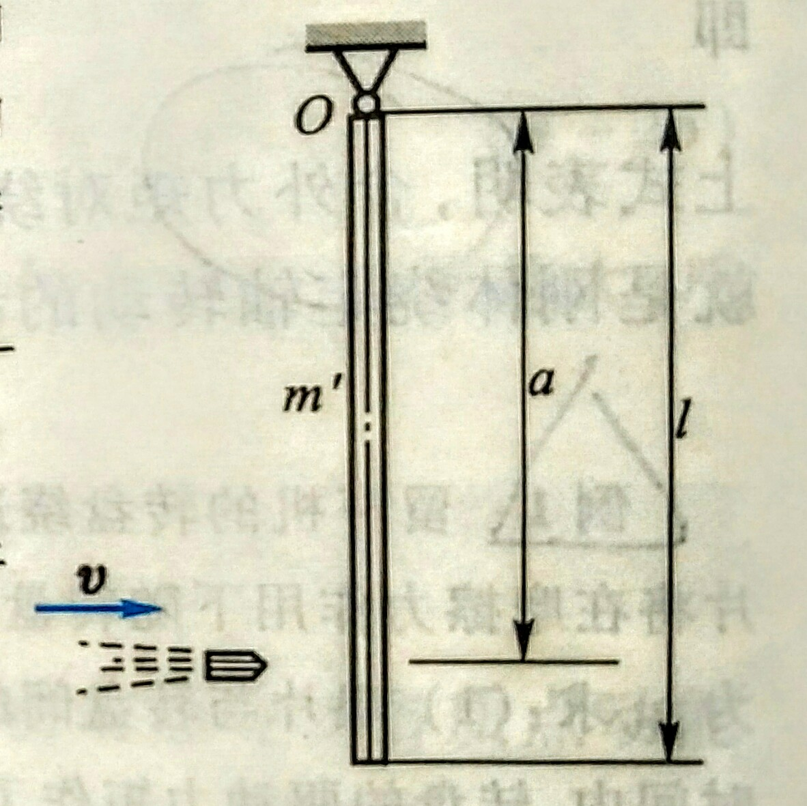

# 从零开始~~放弃~~的大学物理学习指南

## 写在最前

> 熊心瑶世界第一 ____（真的
——大家都这么说

## 基本矢量运算

矢量点积(内积)公式:$\vec{a}\cdot\vec{b}=|\vec{a}||\vec{b}|\cos\theta$

矢量叉积(外积)公式:$\vec{a}\times\vec{b}=\vec{e}|\vec{a}||\vec{b}|\sin\theta$, $\vec{e}$ 方向满足右手定则.

## 质点运动

### 直线运动

直角坐标系中一点P，原点到P的可用位矢$\vec{r}$表示, $\vec{r}=\rm {x} \vec{i} +\rm {y} \vec{j} + \rm {z} \vec{k}$, 位矢大小$|\vec{r}|=\sqrt{x^2+y^2+z^2}$ (矢量运算, 求模不是绝对值).

两点间位移可表示为$\Delta\vec{r}=\vec{r_A}-\vec{r_B}=(\rm {x_A-x_B}) \vec{i} +(\rm {y_A-y_B}) \vec{j} + (\rm {z_A-z_B}) \vec{k}$, 位移只表示两点变化的结果, 不表示实际运动的路径过程.

平均速度: $\overline{\vec{v}}=\dfrac{\vec{r_2}-\vec{r_1}}{\Delta t}=\dfrac{\Delta \vec{r}}{\Delta t}$, 也可以分解成$\overline{\vec{v}}=\overline {v_x} \vec{i} +\overline{v_y} \vec{j} + \overline{v_z} \vec{k}$

速度: $\lim_{\Delta t \rightarrow 0} \dfrac{\Delta\vec{r}}{\Delta t}=\dfrac{{\rm d} \vec{r}}{\rm{d} t}$, 或者 ${\vec{v}}= {v_x} \vec{i} +{v_y} \vec{j} + {v_z} \vec{k}$

其中 $v_x=\dfrac{{\rm d} x}{{\rm d} t}$, $v_y, v_z$以此类推.

公式可根据坐标轴维度自行增删

加速度: $\lim_{\Delta t \rightarrow 0} \dfrac{\Delta\vec{v}}{\Delta t}=\dfrac{{\rm d} \vec{v}}{\rm{d} t}$

#### 一些小结

位移: $\vec s(t)$

速度: $\vec v(t) = \dfrac{{\rm d} \vec s(t)}{{\rm d} t}$

加速度: $\vec a(t) =\dfrac{{\rm d} \vec v(t)}{{\rm d} t}$

注意矢量方向
反过去就是积分关系

一般有两种问题:

1. 已知运动方程求运动状态

2. 已知运动状态求运动方程

速度可以分解, 合成, 可以先分开求解后再合成得出答案
求轨迹图可根据运动方程$x(t), y(t)$, 消去t参数, 就可以得到$y(x)$轨迹

### 圆周运动

法向加速度$\vec{a_n}$(指向圆心), 切向加速度$\vec{a_t}$(运动切线方向)

#### 线量与角量关系

角坐标为时间函数: $\theta(t)$

角速度: $\omega = \dfrac{{\rm d} \theta}{{\rm d} t}$(弧度制)

角加速度: $\alpha=\dfrac{{\rm d}\omega}{{\rm d}t}$

${\rm d} s = R {\rm d} \theta$ (d意为取一微元量, 下同)

$v=\dfrac{{\rm d} s}{{\rm d} t}=R\dfrac{{\rm d} \theta}{{\rm d} t}=R\omega$

$\begin{cases} a_n=\dfrac{v^2}{R}=R\omega^2 \\ a_t=\dfrac{{\rm d} v}{{\rm d} t}=R\dfrac{{\rm d} \omega}{{\rm d} t}=R\alpha \end{cases}$

$\vec{a}=\vec{a_n}+\vec{a_t}$

$|a|=\sqrt{a_n^2+a_t^2}$ (大小)

$\vec{a}=r\alpha \vec{e_t}+r\omega^2 \vec{e_n}$ (方向矢量)

$\theta=\tan^{-1}{\dfrac{a_n}{a_t}}$

### 相对运动(伽利略速度变换)

$\vec{v}=\vec{v'}+\vec{u}$
(接近光速请使用洛伦兹变换)

## 牛顿定理

1. $\vec{v}=恒矢量, 当\vec{F}=0$

2. $\vec{p}=m\vec{v}$, $\vec{F}=\dfrac{{\rm d} \vec{p}}{{\rm d} t}=\dfrac{{\rm d} (m\vec{v})}{{\rm d} t}$, 远小于光速时:$\vec{F}=m\dfrac{{\rm d} \vec{v}}{{\rm d} t}=m\vec{a}$

3. $\vec{F}=-\vec{F'}$

### 常见的力

#### 万有引力

$F=G\dfrac{m_1m_2}{r^2}$, $\vec{F}=-G\dfrac{m_1m_2}{r^2}\vec{e_r}$(矢量形式)

#### 弹性力

常见弹性力有:正压力、张力、弹簧弹性力等
弹簧弹性力:
> $F = −kx$
胡克定律

#### 摩擦力

滑动摩擦力 最大静摩擦力: $F =\mu F_N$
静摩擦力 一般情况: $F_{f_0 m} = \mu_0 F_N$
$F_{f_0}\leq F_{f_0 m}$
$\mu \approx \mu_0$

遗忘得太严重, 只能这样了

## 动量守恒与能量守恒

### 动量定理

微分形式:
$\vec{F}=\dfrac{{\rm d} \vec{p}}{{\rm d} t}=\dfrac{{\rm d} (m\vec{v})}{{\rm d} t}$, $\vec{F}{\rm d} t={\rm d} \vec{p}={\rm d} (m\vec{v})$
积分形式:
$\vec{I}=\int_{t_1}^{t_2}\vec{F}(t){\rm d} t=\vec{p_2}-\vec{p_1}=m\vec{v_2}-m\vec{v_1}$
作用于系统的合外力的冲量等于系统动量的增量(质点的动量定理) ~~我不知道这说的是啥~~

$\vec{F^{ex}}=\dfrac{{\rm d} \vec{p}}{{\rm d} t}$

### 动量守恒定理

$\vec{p}=\sum_{i=1}^n m_i\vec{v_i}=恒矢量$ (系统合外力为零)

### 变力做功

${\rm d}W = \vec{F}\cdot {\rm d} \vec{r}$
$\therefore {\rm d}W=F\cos{\theta}|{\rm d} \vec{r}|$

将微元量积分, 可得
$W=\int_A^B{\vec{F} \cdot{\rm d} \vec{r}}=\int_A^B{F \cos \theta {\rm d} s}({\rm d} s = |{\rm d} \vec{r}|)$(矢量点积公式)

### 质点的动能定理

$W=\dfrac{1}{2}mv_2^2-\dfrac{1}{2}mv_1^2=E_{k2}-E_{k1}$

* 功是过程量，动能是状态量

* 功和动能依赖于惯性系的选取，但对不同惯性系动能定理形式相同.

### 保守力与非保守力

#### 保守力作功的数学表达式

保守力所作的功与路径无关，仅决定于始、末位置.

引力做功:$W=-[(-G\dfrac{m'm}{r_B})-(-G\dfrac{m'm}{r_A})]$

弹力做功:$W=-(\dfrac{1}{2}kx_B^2-\dfrac{1}{2}kx_A^2)$

### 势能

与质点位置有关的能量.

### 功能关系

$W^{ex}+W_{nc}^{in}=(E_k+E_p)-(E_{k0}+E_{p0})$

#### 机械能

$E=E_k+E_p$

$W^{ex}+W_{nc}^{in}=E-E_0$

一般情况碰撞$\vec{F^{ex}} << \vec{F^{in}} \sum_i p_i =\vec{C}$

1. 完全弹性碰撞: 动量和机械能均守恒

2. 非弹性碰撞: 动量守恒，机械能不守恒

3. 完全非弹性碰撞: 动量守恒，机械能不守恒

## 刚体转动

### 角速度与角加速度

角坐标: $\theta=\theta(t)$ (角度是关于时间的函数)

* 沿逆时针方向转动$\theta>0$

* 沿顺时针方向转动$\theta<0$

角位移: $\Delta\theta=\theta(t+\Delta t)-\theta(t)$

角速度: $\omega=\lim_{\Delta t \rightarrow 0}\dfrac{\Delta \theta}{\Delta t}=\dfrac{{\rm d} \theta}{{\rm d} t}$

$\vec{\omega}$正方向, 右手螺旋, 拇指所指的方向

### 匀变速转动

角加速度: $\alpha=\lim_{\Delta t \rightarrow 0}\dfrac{\Delta \omega}{\Delta t}=\dfrac{{\rm d} \omega}{{\rm d} t}$

#### 匀变速直线运动匀变速转动的对比

当加速度/角加速度为常量时

|质点匀变速直线运动|刚体绕定轴作匀变速转动|
|---|---|
|$v=v_0+at$|$\omega=\omega_0+\alpha t$|
|$x = x_0 + v_0 t + \dfrac{1}{2}at^2$|$\theta = \theta_0 + \omega_0 t + \dfrac{1}{2}\alpha t^2$|
|$v^2 =v_0^2 +2a(x−x_0)$|$\omega^2 = \omega_0^2 + 2 \alpha ( θ − θ_0 )$|

#### 角量与线量的关系

$\omega=\dfrac{{\rm d} \theta}{{\rm d} t}$
$\alpha=\dfrac{{\rm d} \omega}{{\rm d} t}=\dfrac{\rm{d^2}\theta}{{\rm d} t^2}$ (两次求导的意思)

$v=r\omega$
$a_t=r\alpha$ (切向)
$a_n=r\omega^2$ (法向)
$\vec{a}=r\alpha \vec{e_t} +r\omega^2\vec{e_n}$

#### 力矩

用来描述力对刚体的转动作用

$\vec{F}$ 对转轴z的力矩
**$\vec{M}=\vec{r}\times\vec{F}$
$M=Fr\sin\theta=Fd$ (d为力臂)

**所以通过中心轴的力的力矩为0**

#### 转动惯量(重点)

$J=\sum_j \Delta m_j r_j^2(离散情况)=\int r^2{\rm d} m(连续的情况下)$

* 转动惯量的单位:kg·m2

* J的意义:转动惯性的量度

##### 刚体的转动惯量与以下三个因素有关

1. 与刚体的体密度 ρ 有关.

2. 与刚体的几何形状及体密度 ρ 的分 布有关.

3. 与转轴的位置有关.

> 说点人话
把转动惯量理解成与质量, 密度一样是一个刚体本身的一种属性就基本OK了

##### 几种常见刚体的转动惯量

(书上一般有表, 在这里写几个常用的)
|物体类型|转动惯量|
|---|---|
细棒(转动轴通过并且垂直于细棒中心)|$J=\dfrac{ml^2}{12}$
圆柱体(转动轴沿几何轴 //理解为圆心, 常用的一个, 滑轮转动问题经常用)|$J=\dfrac{mR^2}{2}$(R为圆柱体半径)
球体(转动轴过球径)|$J=\dfrac{2mR^2}{5}$
细棒(转动轴在细棒的一端且垂直)|$J=\dfrac{ml^2}{3}

#### 转动定律(结合转动惯量与力矩的知识点)

$M=J\alpha$
> 转动定律是解决刚体定轴转动问题的基本方程

#### 平行轴定理

**质量为m的刚体, 如果对其质心轴的转动惯量为$J_C$ ，则对任一与该轴平行，相距为d的转轴的转动惯量: $J_O =J_C +md^2$** (一条重要的公式)

#### 关于运用转动惯量的一般解题思路(不同于高中物理的解题方法)

> 如图所示, 质量为$m_A$的物体A静止在光滑水平面上, 它和一质量不计的纯索相连接, 此绳索跨过一半径为R、质量为$m_c$的圆柱形滑轮C, 并系在另一质量为$m_B$的物体B上, B竖直悬挂, 圆柱形滑轮可绕其几何中心轴转动, 当滑轮转动时, 它与绳索间没有滑动, 且滑轮与轴承间的摩擦力可略去不计, 问:
1. 这两物体的线加速度为多少?水平和竖直两段绳索的张力各为多少?
2. 物体从静止落下距离y时, 其速率为多少?

解题思路

1. 先分别对各个物体分别进行受力分析 **($F_{T2}=F_{T2}'$, $F_{T1}=F_{T1}'$, 但是$F_{T2}\neq F_{T1}$ )

2. 分别计算A, B 加速度(对于此题:$F_{T1}=m_Aa$ **1, $m_B-F_{T2}=m_Ba$ **2)

3. 对于C, 计算力矩 (此题: $M=Fr\sin\theta=Fr=RF_{T2}-RF_{T1}=J\alpha$ **3 (此处结合受力分析以及运用转动定律)

4. 将转动惯量J(查表)代入**3, 并且结合转动线角关系 $a_t=R\alpha$ (滑轮边缘切向加速度与绳索和物体的加速度大小相等), 联立三个方程求解即可

### 角动量与角动量守恒

#### 质点的角动量

$\vec{L}=\vec{r}\times\vec{p}=m\vec{r}\times\vec{v}$

可得
$L=rmv\sin\theta$ (标量形式)**重要的公式**

#### 质点的角动量定理

$\vec{r}\times\vec{F}=\vec{M_{合力矩}}=\dfrac{{\rm d}\vec{L}}{{\rm d} t}=\dfrac{{\rm d}}{{\rm d} t}(\vec{r}\times m\vec{v})$

两端积分:
$\int_{t_1}^{t_2}\vec{M}{\rm d} t=\vec{L_2}-\vec{L_1}$

若$\vec{M}=0$, $\vec{L}=m\vec{r}\times\vec{v}=恒矢量$ (质点的角动量守恒定理)

#### 两道例题

##### 例1

> 一杂技演员M由距水平跷板高为h处自由下落到跷板的一端A, 并把板另一端的演员N弹了起来, 设板是匀质的, 长度为L, 质量为m', 支撑点在板的中部点C, 晓板可绕点C在竖直平面内转动, 演员M, N的质量都是m, 假定演员M落在板上, 与跳板的碰撞是完全非弹性碰撞, 问演员N弹起多高

解题思路:
> 为使讨论简化, 把演员视为质点, 演员M落在板A处的速率为$v_m=\sqrt{2gh}$, 这个, 速率也就是演员M与板A处刚碰撞时的速率, 此时演员N的速率$v_n=0$.**在碰撞后的瞬时, 演员M, N具有相同的线速率u, 其值为$u=\dfrac{l}{2}\omega$, $\omega$为演员和板绕点C的角速率**, 现把演员M, N和板作为一个系统, 并以通过点C垂直纸平面的轴为转轴, 由于M, N两演员的**质量相等**, 所以当演员M碰撞板A处时, **作用在系统上的合外力矩为零**, 故系统的**角动量守恒**

可获得方程:
$$
\begin{cases}
mv_m\dfrac{l}{2}=\overbrace{J\omega}^{棒的角动量}+\overbrace{2mu\dfrac{l}{2}}^{两个演员的角动量}=J\omega+\dfrac{1}{2}ml^2\omega \\ \\
J=\dfrac{1}{12}m'l^2(查表)\\ \\
v_m=\sqrt{2gh}\\ \\
u=\dfrac{l}{2}\omega
\end{cases}
$$

解出$\omega$, 再代入$h'=\dfrac{u^2}{2g}$(自由落体逆过程)

##### 例2

> 有一根质量很小的长度为l的均匀细杆, 可绕通过其中心点O并与纸平面垂直的轴在竖直平面内转动, 当细杆静止于水平位置时, 有一只小虫以速率$v_0$, 垂直落在距点O为l/4处, 并背离点O向细杆的端点A爬行.
设小虫的**质量与细杆的质量均为m**, 问:欲使细杆以**恒定的角速度**转动, 小虫应以多大速率向斜杆端点爬行 . 

解题思路:
> 解小虫落在杆上, 可视完全非弹性碰撞, 且碰撞时间极短, 重力的动量矩可略去不计, 于是, 细杆带着小虫一起以角速度$\omega$转动, 在碰撞前后, 小虫和细杆系统的角动量守恒

有:
$$\overbrace{mv_0\dfrac{l}{4}}^{系统的角动量}=\overbrace{\underbrace{[\dfrac{l}{12}ml^2+m(\dfrac{l}{4})^2]}_{小虫与细棒整体的转动惯量(平行轴定理)}\omega}^{系统的角动量}$$
得
$\omega=\dfrac{12}{7}\dfrac{v_0}{l}$ **1

系统合外力矩仅为小虫重力矩
$M=mgr\cos\theta$ **2

要求角速度恒定
$M=\dfrac{{\rm d} L}{{\rm d} t}=\dfrac{{\rm d}}{{\rm d}t}(J\omega)=\omega\dfrac{{\rm d}J}{{\rm d}t}$ **3

运用平行轴定理
$J=\dfrac{1}{12}ml^2+mr^2$

求微分, 可得
$\dfrac{{\rm d}J}{{\rm d}t}=2mr\dfrac{{\rm d}r}{{\rm d}t}$ **4 (r为关于时间的t函数)

**2 **4 代入 **3, 得
$mgr\cos\theta=2mr\omega\dfrac{{\rm d}r}{{\rm d}t}$

结合
$\theta=\omega t$

求解出$\dfrac{{\rm d}r}{{\rm d}t}$, 即为答案.

### 刚体绕定轴转动的动能定理

$W=\int_{\theta_1}^{\theta_2} M {\rm d}\theta = \int_{\theta_1}^{\theta_2} J\dfrac{{\rm d}\omega}{{\rm d}t} d\theta=\int_{\omega_1}^{\omega_2} J\omega{\rm d}\omega$

$W=\int_{\theta_1}^{\theta_2} M {\rm d}\theta =\dfrac{1}{2}J\omega_2^2-\dfrac{1}{2}J\omega_1^2$

> 可对比动能定理 $W=\int\vec{F}{\rm d}\vec{r}=\dfrac{1}{2}mv_2^2-\dfrac{1}{2}mv_1^2$

#### 几种讨论

类型|配图|结论
|---|---|---|
子弹击入沙袋, 细绳质量不计||动量守恒, 角动量守恒, 机械能**不**守恒 **(以子弹和沙袋为系统)**
子弹击入杆||动量**不**守恒, 角动量守恒, 机械能**不**守恒 **以子弹和杆为系统**
圆锥摆||动量**不**守恒, 角动量守恒, 机械能守恒

#### 一道例题

> 如图所示, 一长为l, 质量为m'的杆可绕支点O自由转动, 一质量为m、速率为v的子弹射入柱內距支点为a处, **使杆的偏转角为30°**, 问子弹的初速率为多少?

解:

> 把子弹和杆看作一个系统, 系统所受的外力有重力和抽对细杆的约束力, 在子弹射入杆的极短时间里, 重力和约束力均通过轴O, 因此他们对轴0的力矩均为零, 系统的角动量应当守恒, 于是有

$$\overbrace{mva}^{子弹入射前一瞬间的角动量}=\underbrace{(\overbrace{\dfrac{1}{3}m'l^2+ma^2}^{平行轴定理计算子弹+细棒整个系统的转动惯量})\omega}_{子弹木棒系统角动量}$$

> 子弹射入后, 细杆在摆动过程中只有重力作功, 故如以子弹、细杆和地球为一系统, 则此系统机械能守恒 . 于是有

$$\overbrace{\dfrac{1}{2}(\dfrac{2}{3}m'l^2+ma^2)\omega^2}^{转动动能}=\underbrace{mga(1-\cos{30^\circ})+\overbrace{m'g\dfrac{l}{2}(1-\cos{30^\circ})}^{质心在棒中心, 故取\dfrac{l}{2}}}_{系统总的重力势能}$$

联立两式就可以解得$v$

## 电磁学

电磁相互关联, 这里就一起写了

> 最重要的两条公式 ($\vec{F}$为一矢量场)
1. 高斯散度定理 $$\int_v\nabla\cdot\vec{F}{\rm d}v=\oint_s\vec{F}\cdot{\rm d}s$$(将体积分转化为**闭合**面积分)

2. 斯托克斯定理 $$\int_s(\nabla\times\vec{F})\cdot{\rm d}s=\oint_c\vec{F}\cdot{\rm d}\vec{l}$$(将面积分转化为**闭合**环路积分)

### 静电场

#### 库仑定律

$$\vec{F}=\dfrac{q_1q_2}{4\pi\varepsilon R^2}\vec{a_R}$$

#### 电场力与电场强度

点电荷q受周围电荷的总作用力为每个电荷单独作用与q的力的矢量和

$$\vec{F}=\sum_{i=1}^n\dfrac{qq_i(\vec{r}-\vec{r_i})}{4\pi\varepsilon |(\vec{r}-\vec{r_i})|^3}$$

探测电荷$q_t$在电荷量$q_t\rightarrow 0$时的受力定义为电场强度.

$$\vec{E}=\dfrac{\vec{F}}{q_t}=\dfrac{q}{4\pi\varepsilon R^2}\vec{a_R}$$

体, 面和线电荷分布情况下电场强度表达式

$$\vec{E}=\dfrac{1}{4\pi\varepsilon}\int_v\dfrac{\rho_v'{\rm d}v'}{|\vec{r}-\vec{r'}|^3}(\vec{r}-\vec{r'})$$

$$\vec{E}=\dfrac{1}{4\pi\varepsilon}\int_s\dfrac{\rho_s'{\rm d}s'}{|\vec{r}-\vec{r'}|^3}(\vec{r}-\vec{r'})$$

$$\vec{E}=\dfrac{1}{4\pi\varepsilon}\int_c\dfrac{\rho_l'{\rm d}l'}{|\vec{r}-\vec{r'}|^3}(\vec{r}-\vec{r'})$$

其中, $\rho$为**单位** 体积/面积/长度 的电荷量, 结合上方公式推导得出的 ~~(这么难的应该不会考吧)~~

电场力与电场强度均符合矢量叠加原理

#### 高斯定理(重点来了)

先来定义电通密度

$$\vec{D}=\varepsilon\vec{E}=\varepsilon_0\vec{E}+\vec{P}$$

再定义穿过曲面$s$的电通

$$\oint_s\vec{D}\cdot{\rm d}\vec{s}=Q$$
> ~~上面的都是废话~~

**就有高斯定理**(证明过程略, ~~应该不会考证明这么丧心病狂~~)
$$\oint_s\vec{D}\cdot{\rm d}s=Q$$
高斯定理指出从一个闭合面静外向电通量等于闭合面内的**净正电荷Q**(可以理解为闭合面内电荷之数量和).

再结合公式: $\vec{D}=\varepsilon\vec{E}=\varepsilon_0\vec{E}+\vec{P}$, 就可以计算出电场强度

##### 用高斯定理求电场强度一点点总结

1. 先找一个**闭合曲面**包裹住电荷(一般是**球面**[点电荷], **圆柱侧面**[带电直导线(有可能是同轴电缆或者是无限长的导线)], 或者是无限大均匀带电平面)
2. 列出高斯定理
3. 代入数据
4. 求出电通密度
5. 求出电场强度(注意高斯面内是否有电介质, 并代入介电常数$\varepsilon$计算)

* 学会分段计算
* 学会把一整块的带电物体进行分割计算部分的电荷量(这一点挺重要的下面有例题)

补充一点: 静电平衡时, **导体内部**的体电荷密度为零, 也**不存在电场**

#### 电势与电场中的储能

电位为单位电荷所做的功

$$V_{ab}=-\int_b^a\vec{E}\cdot{\rm d}\vec{l}$$

点电荷q在b点产生的绝对电位

$$V_b=\dfrac{q}{4\pi\varepsilon R}$$

从电位方程可以求得电场强度$\vec{E}$为 (电位的负梯度)

$$\vec{E}=-\nabla V$$

n个点电荷的静电能量为

$$W=\dfrac{1}{2}\sum_{i=1}^nq_iV_i$$

体电荷连续分布的静电能量为

$$W=\dfrac{1}{2}\int_v\rho_vV{\rm d}v$$

**用$\vec{D}$和$\vec{E}$表示**(记一下这个)
$$W=\dfrac{1}{2}\int_v\vec{D}\cdot\vec{E}{\rm d}v$$

其中单位体积的能量密度
$$w=\dfrac{1}{2}\vec{D}\cdot\vec{E}=\dfrac{1}{2}\varepsilon E^2=\dfrac{1}{2\varepsilon}D^2$$

#### 电容

电容的数学描述

$$C=\dfrac{Q_a}{V_{ab}}$$

平行板电容器
$$C=\dfrac{\varepsilon \overbrace{A}^{面积}}{d}$$

长度为L的圆柱形电容器(同轴电缆)
$$C=\dfrac{2\pi\varepsilon L}{\ln{(\dfrac{b}{a})}}$$

球体电容器电容
$$C=\dfrac{4\pi\varepsilon ab}{b-a}$$

电容串联
$$\dfrac{1}{C_\Sigma}=\dfrac{1}{C_1}+\dfrac{1}{C_2}+...$$

电容并联
$$C_\Sigma=C_1+C_2+...$$

#### 例题

> 一个内半径为b, 外半径为r的孤立导体球壳, 内部同心放置一个有电荷**均匀分布**半径为a的球, 如图所示 . 试求空间各处的电场强度 . 

解
如图所示, 把空间分为四个区域

* 区域I, r<d . 曲面包围的总电荷为

$$Q=\dfrac{4\pi}{3}r^3\rho_v$$

因为电荷均匀分布, $\vec{E}$场不仅是沿半径方向, 并且在**球 (高斯) 面**上为常数, 由

$$
\begin{cases}
\oint_s\vec{E}\cdot{\rm d}\vec{s}=\overbrace{4\pi r^2}^{球 (高斯) 面面积}E_r\\ \\
\oint_s\vec{D}\cdot{\rm d}\vec{s}=Q\\ \\
Q=\dfrac{4\pi}{3}r^3\rho_v\\ \\
\vec{D}=\varepsilon\vec{E}(此处\varepsilon=\varepsilon_0)
\end{cases}
$$

得到:

$$\vec{E}=\dfrac{r}{3\varepsilon_0r^2}\vec{a_r}(0 < r < a)$$

> 注:
${\rho_v}\rightarrow$单位体积的电荷量
如果总电荷量为Q, 球半径为a, 则有单位电荷量为 ${\rho_v}=\dfrac{Q}{\dfrac{4}{3}\pi a^3}$ (这个就是上面说的把电荷分割计算部分的电荷量, 若换为直导线, 计算方法也类似).

* 区域II, a ≤ r < b . 球面包围总电荷量为

$$Q=\dfrac{4\pi}{3}a^3\rho_v$$

由高斯定理得

$$\vec{E}=\dfrac{a^3}{3\varepsilon_0r^2}\rho_v\vec{a_r}(a\leq r<b)$$

* 区域III, $b\leq r\leq c$ . 导体内 $\vec{E}$ 必须为零

* 区域IV, $r\geq c$. 如果孤立导体球壳内表面获得负电荷, 则r=c的外表面必须获得与之等量的正电荷

$$
\begin{cases}
\oint_s\vec{E}\cdot{\rm d}\vec{s}=\overbrace{4\pi r^2}^{球 (高斯) 面面积}E_r\\ \\
\oint_s\vec{D}\cdot{\rm d}\vec{s}=Q\\ \\
Q=\dfrac{4\pi}{3}a^3\rho_v(若题目直接给出带电量Q, 则可以直接使用Q代入计算)\\ \\
\vec{D}=\varepsilon\vec{E}(此处\varepsilon=\varepsilon_0)\\ \\
\end{cases}
$$

此区域电场强度为

$$\vec{E}=\dfrac{a^3}{3\varepsilon_0r^2}\rho_v\vec{a_r}(r
\geq c)$$

* 如果题目中有说有电介质, 则将$\varepsilon_0$变为相应的$\varepsilon$进行计算(题目大同小异)

* 结合电位公式$V_{ab}=-\int_b^a\vec{E}\cdot{\rm d}\vec{l}$可以求解空间各点电位问题

* 结合电容公式$C=\dfrac{Q_a}{V_{ab}}$, 就可以求解电容问题

### 恒定电流

定义电流
$$i=\dfrac{{\rm d}q}{{\rm d}t}$$

单位面积的电流称为电流密度

$$\Delta I=\vec{J}\cdot\Delta \vec{s}$$
通过面积s的电流

$$I=\int_s\vec{J}\cdot{\rm d}\vec{s}$$

运流电流(自由空间中飞的电子形成的电流)密度为
$$\vec{J}=\rho_v\vec{U_v}$$
$\rho_v$为体电荷密度, $\vec{U_v}$为电荷运动平均速度

传导电流(导线里面的)密度为
$$\vec{J}=\sigma\vec{E}(又叫欧姆定律微分形式)$$
$\sigma$为媒质电导率, $\vec{E}$为导体中的电场强度
> ~~上面这俩看看就行了~~

#### 焦耳定律

功率密度
$$p=\vec{J}\cdot\vec{E}$$

整个体积内功率
$$P=\int_vp{\rm d}v=\int_v\vec{J}\cdot\vec{E}{\rm d}v$$

整个导体发热功率
$$P_d=I^2R=\dfrac{V^2}{R}$$

#### 电动势

静电场中
$$\oint_c\vec{E}\cdot{\rm d}\vec{l}=0$$

流过导体的电流
$$I=\int_s\vec{J}\cdot{\rm d}\vec{s}=\int_s\sigma\vec{E}\cdot{\rm d}\vec{s}$$

在外加电场(电源)的作用$\vec{E'}$下, 闭合回路中总电场为$\vec{E}+\vec{E'}$, 相应总功率
$$P=\int_v(\vec{E}+\vec{E'})\cdot\vec{J}{\rm d}v$$

假设回路中恒定电流电流是均匀分布的, 用$I{\rm d}\vec{l}$代替$\vec{J}{\rm d}v$

化简积分
$$P=\oint_cI(\vec{E}+\vec{E'})\cdot{\rm d} \vec{l}=I\oint_c\vec{E'}\cdot{\rm d} \vec{l}$$

定义电动势为
$$\epsilon=\oint_c\vec{E'}\cdot{\rm d} \vec{l}$$

供给回路的功率是
$$P=\epsilon I$$

> 这里的瞄一眼就OK了

### 静磁场

静磁场是研究由运动电荷建立的与时间无关的场

于是用电流定义在媒质中的**磁通密度**(毕奥-萨伐尔定律)
$$\vec{B}=\dfrac{\mu}{4\pi}\int_c\dfrac{I{\rm d}\vec{l}\times\vec{R}}{R^3}$$

同时用**磁场强度**定义**磁通密度**为(重要)
$$\vec{B}=\mu\vec{H}$$

载流导体在磁场中受到的力由**安培力定律**
$$\vec{F}=\int_cI{\rm d}\vec{l}\times\vec{B}$$
确定, 此处$\vec{B}$为式中电流I以外的源所产生的磁通密度
又有$\vec{F}=q\vec{v}\times\vec{B}$

通过一个开表面的磁通(等下会用到)
$$\Phi=\int_s\vec{B}\cdot{\rm d}\vec{s}$$

通过闭合面的静磁通量等于零. 即
$$\oint_s\vec{B}\cdot{\rm d}\vec{s}=0或\nabla\cdot B=0$$

**安培环路定律(重要)**
$$\oint_c\vec{H}\cdot{\rm d}\vec{l}=I或\nabla\times\vec{H}=\vec{J_v}$$
若电流或者电流分布是高度**对称**的, **由上式可以计算出$\vec{H}$场.**

安培环路定律常用解题步骤

1. 分析磁场对称性
2. 根据磁场对称性建立安培环路
3. 利用公式计算磁场强度$\vec{H}$
4. 根据$\vec{B}=\mu\vec{H}$计算磁通密度

#### 常用的磁通密度

导线类型|计算磁通密度(空气为介质)
---|---
无限长载流直导线|$B=\dfrac{\mu_0I}{2\pi r}$
**半**无限长载流直导线|$B=\dfrac{\mu_0I}{4\pi r}$
载流圆形线圈|$B=\dfrac{\mu_0I}{2R}$
半圆形|$B=\dfrac{\mu_0I}{4R}$
无限长直螺线管|$B=\mu_0nI$

磁场能量密度
$$w_m=\dfrac{1}{2}\vec{B}\cdot\vec{H}=\dfrac{1}{2}\mu H^2=\dfrac{1}{2\mu}B^2$$

磁场能量
$$W=\int_v w\ {\rm d}v$$

#### 例题

> 一根极长的沿轴放置的空心导体, 其外径为b, 内径为a, 载有沿轴方向的电流I, 如图5-21a所示 . 若电流是**均匀分布**的, 试求在空间任一点的磁场强度 . 
此题使用圆柱坐标解题 ( $\rho,\ \phi,\ z$坐标系 ) 更佳

电流均匀分布, 因此可以先算电流密度$\vec{J_v}=\dfrac{\vec{I}}{S}$(总电流除以面积), 此处则有
$$\vec{J}=\dfrac{I}{\pi r(b^2-a^2)}$$
根据对称的理由, 磁力线应是同心圆, 磁场强度应在$\phi$方向, $H_\phi$沿每一圆环为一常数 . 此处有三个区域, 我们分别对每一区域求磁场强度 . 

* (a)区域1. $\rho\leq a$: 对于任何闭合环路来说, 所包围的电流为零, 即$\rho$=1时, $\vec{H}=0$

* (b)区域2. $a\leq\rho\leq b$: 图b示半径为$\rho$的闭合圆环截流导体截面图 . 所包围的净电流为

$$\begin{eqnarray}I_{enc}
  &=&\int_s\vec{J_v}\cdot{\rm d}\vec{s}=\dfrac{I}{\pi r(b^2-a^2)}\int_a^\rho \rho{\rm d}\rho\int_0^{2\pi}{\rm d}\phi\\
  &=&\dfrac{I(\rho^2-a^2)}{b^2-a^2}\\
\end{eqnarray}$$
> 电流除以圆环总面积在乘以包围住的面积, 就计算出环路内被包围的电流,~~其实不用写积分直接算就OK(真的~~

另一方面
$$\oint_c\vec{H}\cdot{\rm d}\vec{l}=2\pi\rho H_\phi$$

因此结合安培定律可得
$$\vec{H}=\dfrac{I}{2\pi\rho}\left[\dfrac{\rho^2-a^2}{b^2-a^2}\right]\vec{a_\phi}\ (\vec{a_\phi}表示方向),\ a\leq\rho\leq b$$

* (c)区域3, $\rho\geq b$: 观测点在导体之外(见图5-21c). 因此包围的净电流为I. 在此区域的磁场强度为

$$\vec{H}=\dfrac{I}{2\pi\rho}\vec{a_\rho},\ \rho\geq b$$

> 其他的利用安培定律计算的题目也跟这个类似啦, 希望可以举一反三哦

### 时变电磁场

导体在磁场中移动产生的运动emf(电动势)为(动生电动势)
$$e_m=\int_c(\vec{u}\times\vec{B})\cdot{\rm d}\vec{l}$$
式中$\vec{u}$为导体的速度, $\vec{B}$为磁通密度, 闭合导体中由运动emf产生的感应电流是在感应电流场$(\vec{u}\times\vec{B})$的方向

通过在空间固定的N匝线圈所包围的面积的时变磁通产生的变压器emf为(感生电动势)
$$e_t=-N\int_s\dfrac{\partial\vec{B}}{\partial t}\cdot{\rm d}\vec{s}\ (磁通密度\vec{B}对时间求偏导数)$$
> ~~如果没学过偏导数的话... 那就百度一下吧~~

线圈自感的定义

$$L=N\dfrac{{\rm d}\Phi}{{\rm d}i}$$

线圈互感的定义

$$L_{21}=N_2\dfrac{{\rm d}\Phi_{21}}{{\rm d}i_1}$$
> 式中$L_{21}$为**线圈2**由**线圈1所产生的磁通**引起的互感(脚标表示的意义的顺序不要搞反咯, 谁产生磁通就除以谁的电流)

* **此处N均为匝数**

同理
$$L_{12}=N_1\dfrac{{\rm d}\Phi_{12}}{{\rm d}i_2}$$

> 简化一下 $L=N\dfrac{\Phi}{i}$

计算自感的方式

1. 假设电感内电流强度为I
2. 计算磁通密度$\vec{B}$
3. 计算磁通$\Phi=N\int_s \vec{B}\cdot{\rm d}\vec{s}$
4. 根据定义计算自感$L=N\dfrac{\Phi}{i}$

若以自感计算磁场能量, 有
$$W_m=\dfrac{1}{2}LI^2$$

这章我就不放例题了...

### 补充

电磁场的结构方程
$$
\left.
\vec{D}=\varepsilon\vec{E}\\
\vec{J}=\sigma\vec{E}\\
\vec{B}=\mu\vec{H}
\right.
$$
式中
$\varepsilon\ 电容率\ (自由空间(真空)中\ \varepsilon_0=8.854\times 10^{-12}F/m)\\\mu\ 磁导率\ (自由空间(真空)中\ \mu_0=4\pi\times 10^{-7}H/m)\\\sigma\ 电导率$

位移电流: 电容器之间的 "电流" 不能由传导产生

#### 麦克斯韦方程组

积分形式
$$\begin{eqnarray}
\oint_c\vec{E}\cdot{\rm d}\vec{l}&=&-\int_s\dfrac{\partial\vec{B}}{\partial t}\cdot{\rm d}\vec{s} \\
\oint_c\vec{H}\cdot{\rm d}\vec{l}&=&\int_s\vec{J}{\rm d}s+\int_s\dfrac{\partial\vec{D}}{\partial t}\cdot{\rm d}\vec{s}\\
\oint_s\vec{D}\cdot{\rm d}\vec{s}&=&\int_v\rho_v{\rm d}v\\
\oint_s\vec{B}\cdot{\rm d}\vec{s}&=&0
\end{eqnarray}$$