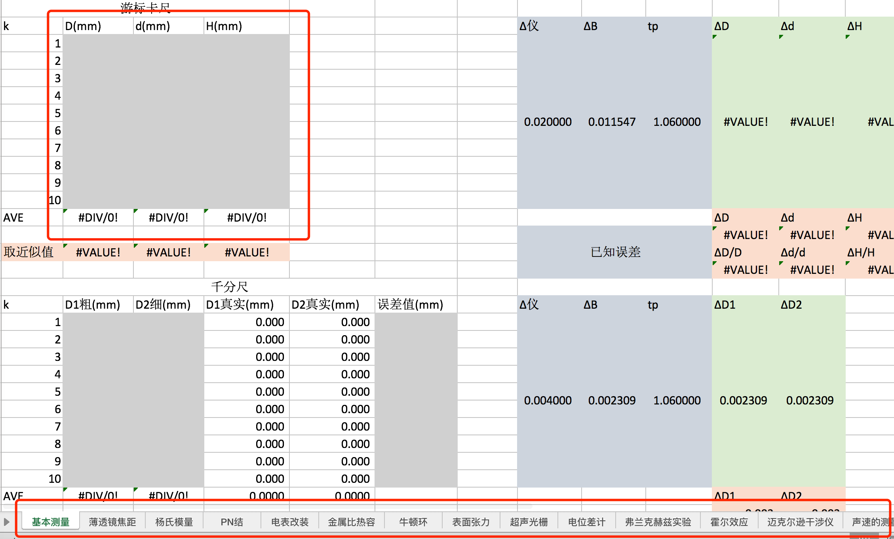
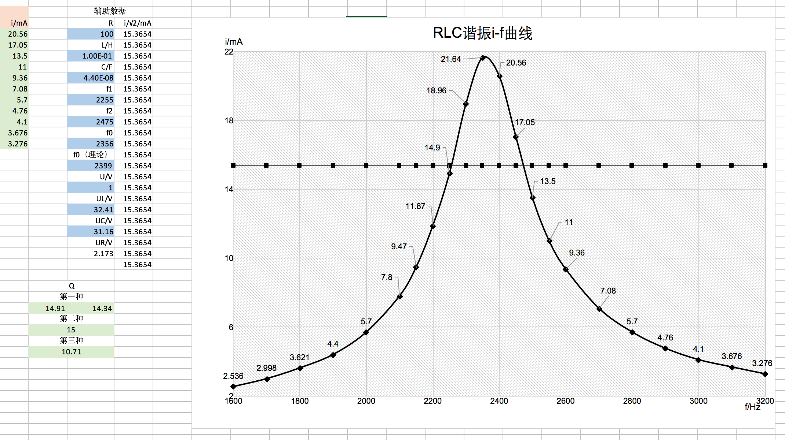

# 大学物理实验数据处理合集

听说阿苞不仅要学习大学物理, 还要做大学物理实验, 于是我翻了翻箱底, 找出了两年前做的一个可以数据处理的Excel表格合集, 希望可以简化老苞的数据处理工作, 表格还附带作图, ~~(虽然不知道农林版本的大学物理实验跟工科的一不一样~~

## 用法

表格有一些需要做近似处理的地方要用到宏, 是我自己弄得, 保证没有病毒, 可以放心开启, 如果用不了宏的话用内置的ROUND函数也可以, 改一下要用到宏的地方的单元可函数就可以啦

建议使用Microsoft Office 2013以上的版本 ~~(如果没有, 房间通知一下, 破解版了解一下)~~

### 数据处理

在下方选项中选择对应的实验, 然后上方表格灰色填入实验数据, 然后在橙色表格中就可以得到答案啦(大概好像是这样, 我忘掉了...彩色的单元格里面是嵌入了计算公式的)

不知道你们的实验数据量跟这个会不会有出入(国际单位之间的转化啊什么的, 用的时候也要注意结果的数量级, 有可能输入的数据的单位制不一样, 有可能会计算出来同一个数量级的数据), 所以还是要根据实际情况使用啦
♪(\^∇\^*)

_在`1, 2`文件夹里面有分开的表格 ~~(里面数据可以作弊)~~_

### 作图

一般有作图的我都写好啦, 可以直接有数据出对应的图图表, 一些需要用到数据拟合的图标也是弄好的, 如果要用到的话, 根据实际调整一下样式就可以了♪(\^∇\^*)

_不要在意这种直男风格的图标样式_

最后按照河内惯例祝学业与偶像事业都能upup, ~~阿苞人设不能崩~~
♪(\^∇\^*)